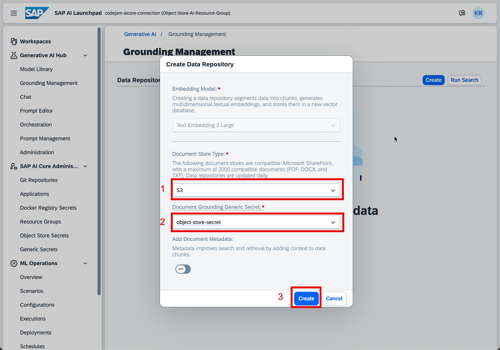
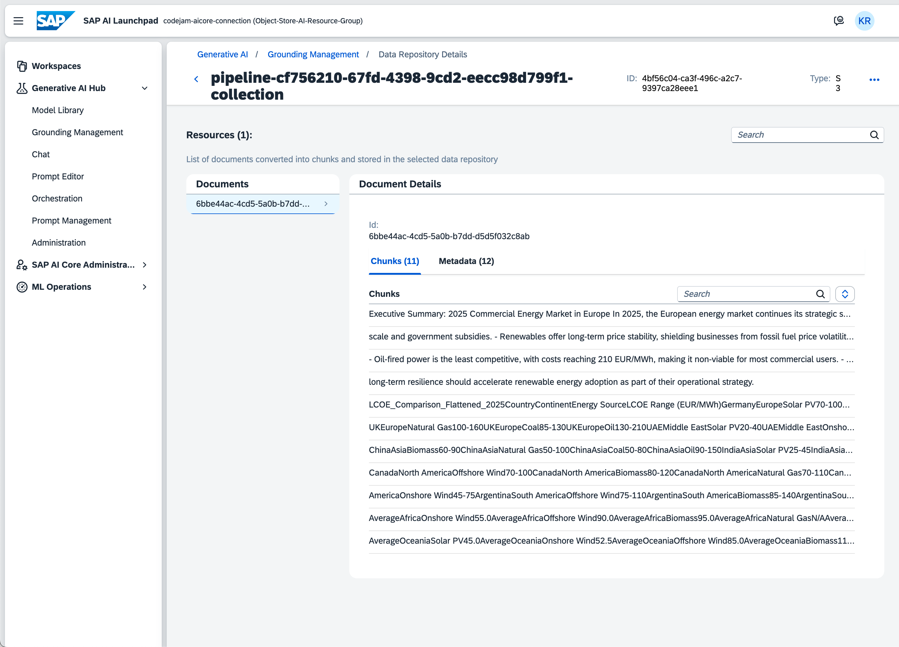

# Exercise 01 - Understand the Document Grounding Pipeline

_Estimated Time: **05 min**_

In this exercise, you will learn what a document grounding pipeline is. This pipeline will pull a document from an S3 bucket on AWS, chunk it, vectorize it, and store it in a central SAP HANA Cloud vector engine.

## Table of Contents

- [Exercise 01 - Understand the Document Grounding Pipeline](#exercise-01---understand-the-document-grounding-pipeline)
- [The Document Grounding Pipeline](#the-document-grounding-pipeline)
- [Summary](#summary)
  - [Questions for Discussion](#questions-for-discussion)
- [Further Reading](#further-reading)

## The SAP HANA Cloud Vector Engine & Vector Embeddings

### The SAP HANA Cloud Vector Engine

SAP HANA Cloud is the leading in-memory database on the market. It is also the go-to database for CAP applications. SAP has added the vector engine to the SAP HANA database. The vector engine provides a data foundation for a new set of natural and intuitive capabilities. For this CodeJam, you will use the vector engine to augment large language models with business context. You will use the vector engine for two things. The engine stores relevant business data as vector embeddings and, second, searches for similar and relevant vector embeddings based on the user's prompts. The corresponding text of these vector embeddings then gets passed along to a defined LLM for accurate business answers using that contextual information.

The nature of a vector engine is to seamlessly work with generative AI applications. By providing the ability to store different types of data, such as text, images, or sound, in the form of vector embeddings, the vector engine can be used to pass data along with Retrieval Augmented Generation (RAG) requests, natural language processing, image recognition, similarity searches, and recommendation systems.

The SAP HANA Cloud vector engine comes bundled with the SAP HANA Cloud instance on the SAP Business Technology Platform. Within your subaccount on SAP BTP, you or the global account admin can assign entitlements to enable the SAP HANA Cloud service plan.
Vector embeddings are just one of the supported data types for SAP HANA. They can be used for SQL queries and HANA operations.

For this workshop we will use a central SAP HANA Cloud vector engine managed by SAP and consumed through the grounding pipeline.

### What are Vector Embeddings

AI models operate on data in a purely mathematical manner. An AI model by itself needs unstructured data such as text, audio or images be represented in a numerical way for it to operate on that data. To bridge the gap between unstructured data and the required numerical format for the AI model, the data must be converted to a numeric form. Vector embeddings are a way to represent unstructured data in a multi-dimensional numeric way for the AI model to process.

To perform this transformation an embedding model can be used. These embedding models can be pre-trained on a great number of data sets or you can utilize a model by training it yourself. In any case the embedding model creates an output vector representing unstructured data with the goal of meaningful similarity. That means the vector embedding should represent the semantic meaning of the real-world data. This allows for the mathematical assumption that two vector embeddings, which are similar to each other, have a high probability of being similar to their real-world data representation. The same is true for data that is dissimilar.

Using an embedding model to create vector embeddings, a numerical representation of real-world unstructured data, can help provide contextual information to an AI model that, based on that numerical data, can provide a proper answer to a user's question.

This is what you will do in the following exercises. You will use unstructured data, transform it into many vector embeddings, storing them in the SAP HANA Cloud Vector Engine. These vector embeddings than get compared to a vector embedding containing the user's questions using a mathematical algorithm. This comparison should return a vector embedding most similar to the numerical representation of the user's query. The resulting vector embedding's real-world data can now be used to provide contextual information to a chat model to retrieve a fitting answer to the user's query.

You can use two different algorithms for creating a comparison between vector embeddings:

- Euclidean distance measures the average linear distance between the different vectors.

- Cosine distance measures the cosine of the angle between two vectors. The result is between -1 and 1 whereas 1 represents complete similarity between two vectors, -1 the complete opposite and 0 that the two vectors are unrelated.

These two algorithms are different in the way of how they calculate the actual distance between two vectors. The closer the distance, the higher the probability of similarity.

If you are interested in the mathematical representation of these two algorithms, read an interesting article on the topic in the **Further Reading** section.

An easy approach to which algorithm to use is to simply try them both out and see what algorithm provides a better result.

## The Document Grounding Pipeline

For this workshop, the S3 bucket is provided through the SAP Business Technology Platform Document Store service. The document was already uploaded to the document store on BTP. To pull the document from the document store, a secret is needed to properly authenticate against the document store. The secret was also pre-configured to keep the exercise concise and focused on the task at hand.

The Document Grounding service, as part of the grounding pipeline on SAP AI Core, is a great tool to simplify the grounding process of a contextual document for an orchestrated Retrieval Augmented Generation flow.

It automates the chunking and vectorization through a vector embedding process and stores these vector embeddings. Another benefit is that you don't need your own SAP HANA Cloud instance to utilize the vector engine. It uses a central SAP-hosted instance, which assigns a tenant to you where your vector embeddings are stored.  
Through that approach, you can save on provisioning your own SAP HANA Cloud instance if you only want to use the vector engine feature.

The chunking is currently not configurable and uses a default chunking setting, where the chunk size and parameters are set to divide the contextual document by section.

> NOTE: The following steps are already done for this workshop. Please do not follow the steps; they are just for your understanding!

Using the **Grounding Management** on SAP AI Launchpad, you can simply create the pipeline.

As you can see, you simply define the **Document Store Type**—in our case, the **S3** bucket—and select the generic secret for authorization and authentication.

After the creation of the pipeline, the service will pull the documents, vectorize them, and store them in the vector engine.

## Summary

At this point, you have understood what the document grounding pipeline is and how it consumes an S3 bucket on AWS.

### Questions for Discussion

1. Can you currently configure the chunking parameters?

Answer

   No, at this point it is not possible to configure the chunking parameters for the document chunking. It applies a default chunking to prepare the contextual document for vectorization.

2. What information can you see when navigating into the detail screen of the data repository?

Answer

    You can inspect the chunks and the metadata. You can also search for specific chunks if you want to.

3. How are vector embeddings created in the SAP HANA Cloud system?

Answer

Vector embeddings are created using an embedding model, which can either be pre-trained or trained by the user. The process typically involves the following steps:

- Load the unstructured data (e.g., text).
- Split the text into meaningful chunks.
- Feed these chunks into the embedding model to generate numerical vectors (embeddings).
- Store the embeddings in the SAP HANA Cloud Vector Engine for later use.

4. What are the two algorithms used to compare vector embeddings, and how do they differ?

Answer

The two algorithms used to compare vector embeddings are Euclidean Distance and Cosine Similarity.

- **Euclidean Distance** measures the average linear distance between two vectors. The closer the vectors, the more similar they are.

- **Cosine Similarity** calculates the cosine of the angle between two vectors, resulting in a value between -1 and 1. A cosine similarity of 1 indicates complete similarity, while -1 means complete dissimilarity, and 0 indicates no relationship. These algorithms differ in how they compute the "distance" or "similarity" between vectors, with cosine similarity being more sensitive to the direction of the vector rather than the magnitude.

## Further Reading

- [Generative AI Hub on SAP AI Core - Help Portal (Documentation)](https://help.sap.com/docs/sap-ai-core/sap-ai-core-service-guide/generative-ai-hub-in-sap-ai-core-7db524ee75e74bf8b50c167951fe34a5)
- [Out-of-the-Box Document Grounding in SAP AI Core: RAG with SAP Help Portal](https://community.sap.com/t5/technology-blog-posts-by-sap/out-of-the-box-document-grounding-in-sap-ai-core-rag-with-sap-help-portal/ba-p/14076473)
- [Document Grounding in SAP AI Core: RAG with AWS S3 via Object Store Service on SAP BTP](https://community.sap.com/t5/technology-blog-posts-by-sap/document-grounding-in-sap-ai-core-rag-with-aws-s3-via-object-store-service/ba-p/14078294)
- [SAP Business Accelerator Hub - Grounding API](https://api.sap.com/api/DOCUMENT_GROUNDING_API/overview)

---

[Next exercise](../02-create-prompt-template/readme.md)
