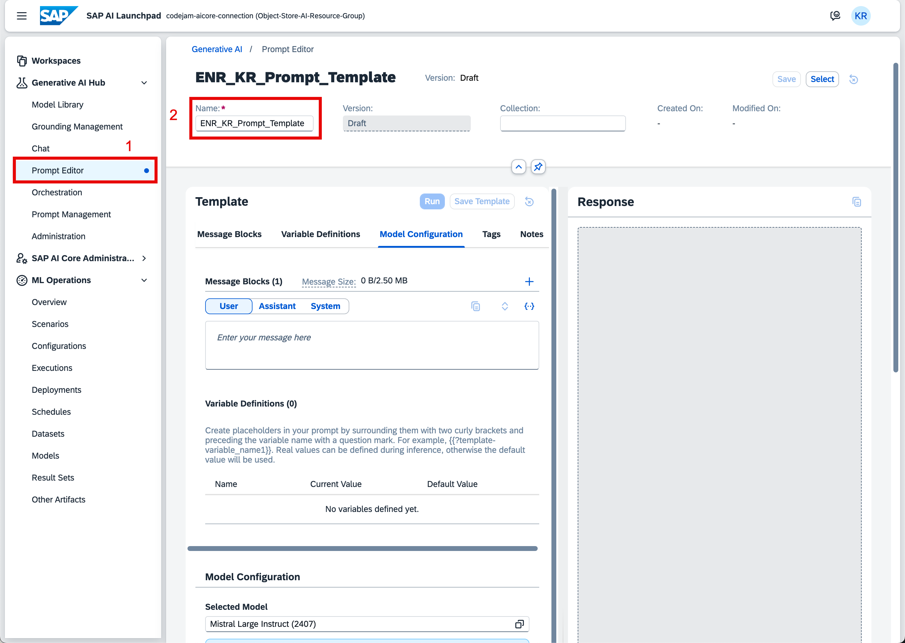
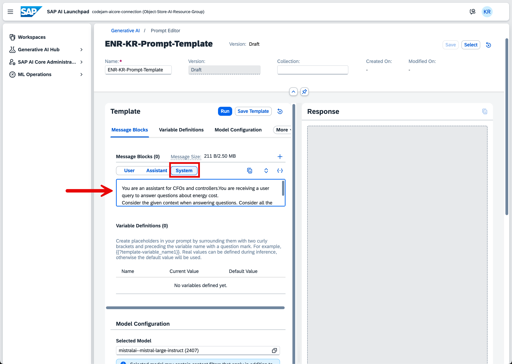
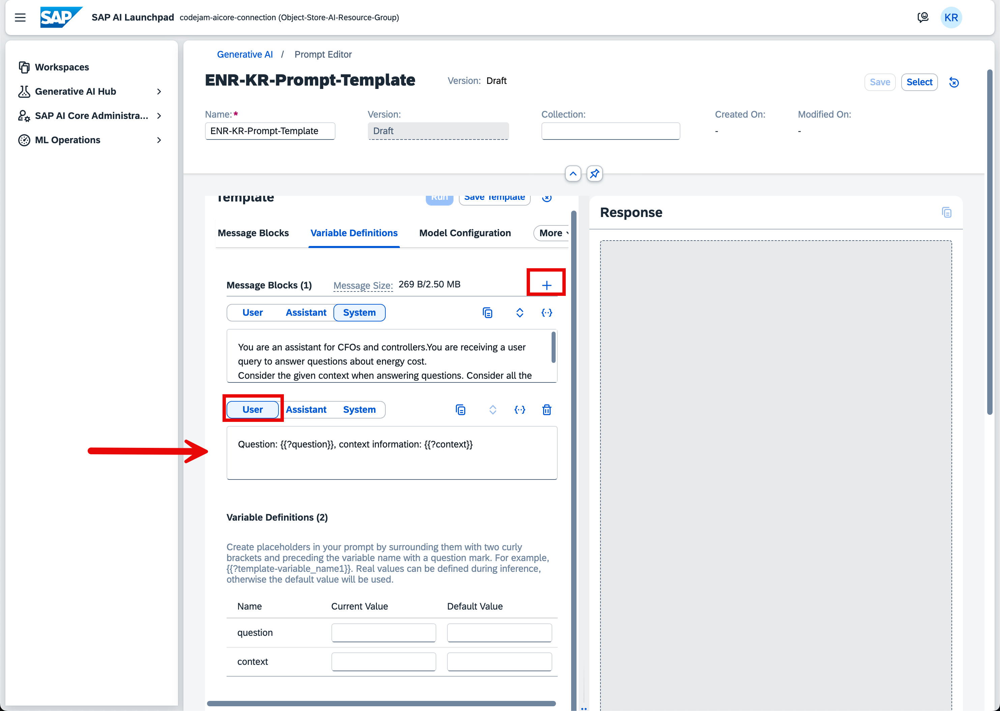
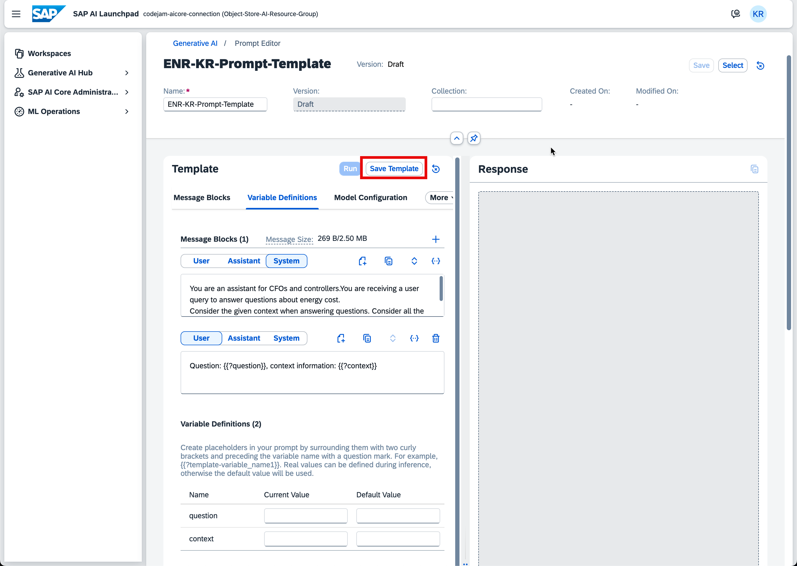
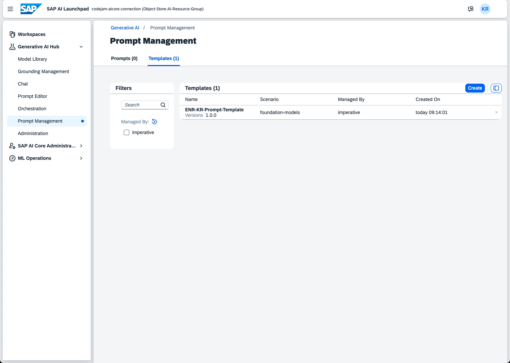

# Exercise 02 - Create a Prompt Template with the SAP AI Launchpad

_Estimated Time: **25 min**_

In this exercise, you will learn how to create a prompt template to use later in the creation of an orchestration flow. You will create a system prompt and add prompt variables for injecting contextual information from the user query to the LLM.

## Table of Contents

- [Exercise 02 - Create a Prompt Template with the SAP AI Launchpad](#exercise-02---create-a-prompt-template-with-the-sap-ai-launchpad)
- [What is a Prompt Template?](#what-is-a-prompt-template)
  - [Why are prompt templates helpful?](#why-are-prompt-templates-helpful)
  - [Using Prompt Templates from SAP AI Launchpad with the SAP Cloud SDK for AI](#using-prompt-templates-from-sap-ai-launchpad-with-the-sap-cloud-sdk-for-ai)
- [Create a New Prompt Template](#create-a-new-prompt-template)
  - [Set the System Message](#set-the-system-message)
  - [Set the User Message](#set-the-user-message)
  - [Save the Template](#save-the-template)
- [Summary](#summary)
  - [Questions for Discussion](#questions-for-discussion)
- [Further Reading](#further-reading)

## What is a Prompt Template?

A **prompt template** is a reusable structure for creating prompts that you send to an LLM. It typically contains fixed instructions or context (such as a system prompt) and placeholders (variables) that can be filled in with dynamic information when the prompt is used.

For example, a prompt template might look like this:

```
You are a helpful assistant. Answer the following question based on the provided context.

Context: {{context}}
Question: {{question}}
```

Here, `{{context}}` and `{{question}}` are variables that can be replaced with specific information at runtime.

### Why are prompt templates helpful?

- **Consistency:** They ensure that prompts follow a standard format, leading to more predictable and reliable model responses.
- **Efficiency:** You can quickly generate new prompts by filling in variables, saving time and reducing manual effort.
- **Reusability:** Templates can be used across different tasks, users, or workflows without rewriting the entire prompt each time.
- **Maintainability:** If you need to update instructions or context, you only need to change the template, not every individual prompt.

In summary, prompt templates make it easier to manage, scale, and optimize interactions with LLMs, especially in applications where similar types of queries are made repeatedly.

### Using Prompt Templates from SAP AI Launchpad with the SAP Cloud SDK for AI

Prompt templates created in SAP AI Launchpad can be accessed and used programmatically in your applications by leveraging the SAP Cloud SDK for AI. This allows you to automate prompt generation, inject dynamic variables, and integrate LLM-powered features into your workflows.

**Typical steps:**

1. **Retrieve the Prompt Template**
   - Use the SAP Cloud SDK for AI to call the SAP AI Core Prompt Registry API and fetch the desired prompt template by its ID or list all available prompt templates from a given scenario.

2. **Inject Variables**
   - Replace the template’s placeholders (e.g., `{{context}}`, `{{question}}`) with your actual data at runtime.

3. **Send the Prompt to the LLM**
   - Use the SDK to send the filled prompt to the LLM endpoint and receive the model’s response.

```JavaScript
const response: PromptTemplateListResponse =
  await PromptTemplatesApi.listPromptTemplates({
    scenario: 'test'
  }).execute();
```

Using the SAP AI Launchpad's prompt registry allows for:

- Centralized management of prompt templates in SAP AI Launchpad
- Consistent prompt structure across applications
- Easy updates: change the template in Launchpad, and all consuming apps use the new version automatically

## Create a New Prompt Template

👉 In the SAP AI Launchpad, open the **Prompt Editor** via the **Generative AI Hub**.

👉 Give your new prompt template a name following this pattern: `<Initials>_Prompt_Template`:



### Set the System Message

For this prompt template, you will provide a system message setting the tone, the target audience, and some additional instructions for the LLM.

The use case is that you create an assistant tailored for CFOs and financial controllers to understand different costs for energy sources. Through retrieval augmented generation (RAG), you will provide contextual information about the current market to the language model. The document was already vectorized and stored in the SAP HANA Cloud vector engine through the grounding pipeline.

👉 Within your prompt template, select the **System** tab under the **Message Blocks** section.

You will see an empty text field. Within that text field, you will provide the system message.

👉 Enter the following message into the text field:

```text
You are an assistant for CFOs and controllers. You are receiving a user query to answer questions about energy costs. 
Consider the given context when answering questions. Consider all the input before responding.
```



### Set the User Message

You will provide the user question and the context information within the user message to the LLM when creating a RAG flow. Both the user question and the context information will be filled dynamically during runtime. To achieve this, you can define variables within the user message, and also in the system or assistant message if needed.

👉 Create another message object by clicking on the **+** icon.

👉 Select the **User** tab to define the message as a user message.

👉 Add the following text to specify the user question and context variables:

```text
Question: {{?question}}, context information: {{?context}}
```

You should notice two new variables appearing under the **Variable Definitions** section.



You could set current and default values for the variables if needed. In our case, we don't need to do this, so leave it empty.

### Save the Template

You could change the model configuration in the **Prompt Editor** to test your current prompt. We won't do this because you will create an orchestration flow next to test the template.

👉 Go ahead and save the template via the **Save Template** button.



👉 In the upcoming pop-up dialog, select and enter the following values:

| Key            | Value                   |
|----------------|------------------------|
| Scenario Name  | foundation-models       |
| Template Name  | <Initials>-Prompt-Template |
| Version        | 1.0.0                   |

👉 Click on **Save**.

You can inspect the saved templates via the **Prompt Management** screen.

👉 Click on **Prompt Management** to see your template.



## Summary

In this exercise, you have learned what prompt templates are and how to create them via SAP AI Launchpad. You have also learned how to consume them via the SAP Cloud SDK for AI.

### Questions for Discussion

1. How can the Prompt Editor in SAP AI Launchpad help with storing and managing prompts?
<details><summary>Answer</summary>
The Prompt Editor allows you to save prompts and their responses for later use or comparison. It’s useful for tasks that require repeated use of the same prompt. You can save different versions of prompts, specify parameters like Max Tokens, and view the number of tokens used. For example, you can save a Chain of Thought prompt for customer support classification and reuse it in the future without retyping the prompt. Saved prompts can be managed under Prompt Management for easy access.
</details>

## Further Reading

- [SAP Cloud SDK for AI documentation](https://sap.github.io/ai-sdk/)

---

[Next exercise](../03-setup-orchestration-pipeline/readme.md)