# Exercise 03 - Set up an orchestration pipeline with the SAP AI Launchpad

_Estimated Time: **45 min**_

In this exercise, you will leverage the SAP AI Core orchestration service to define a complete RAG flow from grounding all the way to content filtering, data masking, and testing.

Before you start, you must understand what the orchestration service is.

## Table of Contents

- [Exercise 03 - Set up an orchestration pipeline with the SAP AI Launchpad](#exercise-03---set-up-an-orchestration-pipeline-with-the-sap-ai-launchpad)
- [Understand the Orchestration Workflow](#understand-the-orchestration-workflow)
- [Create a new Orchestration Workflow](#create-a-new-orchestration-workflow)
  - [Grounding](#grounding)
  - [Templating](#templating)
  - [Input Translation](#input-translation)
  - [Data Masking](#data-masking)
    - [Anonymization](#anonymization)
    - [Pseudonymization](#pseudonymization)
  - [Input Filtering](#input-filtering)
  - [Model Configuration](#model-configuration)
  - [Output Filtering](#output-filtering)
  - [Output Translation](#output-translation)
- [Test the orchestration configuration](#test-the-orchestration-configuration)
- [Summary](#summary)
  - [Questions for Discussion](#questions-for-discussion)
- [Further reading](#further-reading)

## Understand the Orchestration Workflow

The orchestration service operates under the global AI scenario orchestration, which is managed by SAP AI Core. This service enables the use of various generative AI models with unified code, configuration, and deployment.

In this orchestration, the harmonized API allows you to use different foundation models without changing the client code. To use different foundation models and versions, you need to create at least one orchestration deployment or use the orchestration deployment in your default resource group.

Key features include:

**Templating:** This feature lets you compose prompts with placeholders that are filled during inference.

**Content filtering:** This feature allows you to restrict the type of content passed to and received from a generative AI model.

**Data masking:** This feature enables data masking through anonymization or pseudonymization before passing it into a generative AI model. If pseudonymization is used, masked data in the model's response will be unmasked.

**Grounding:** This feature lets you integrate external, contextually relevant, domain-specific, or real-time data into AI processes. This data enhances the natural language processing capabilities of pretrained models, which are trained on general material.

**Translation:** This feature lets you integrate translation into your orchestration workflow for both input and output.

To use the orchestration service, you must generally create an orchestration deployment. For this workshop, this is already done.

The order in which the pipeline is executed is defined centrally in orchestration. However, you can configure the details for each module and omit optional modules by passing an orchestration configuration in JSON format with the request body or including the JSON object in code using the SAP Cloud SDK for AI.

> Note that you can't store the orchestration workflow centrally in SAP AI Launchpad. You can only define it but must download the configuration JSON afterwards.

The orchestration workflow looks like the following:

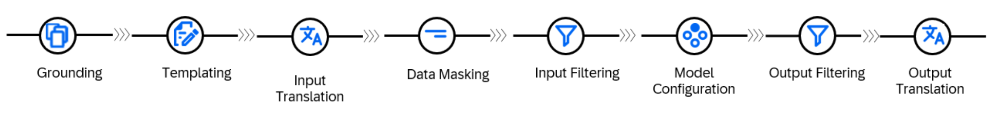

## Create a new Orchestration Workflow

👉 To create a new Orchestration Workflow, open the **Orchestration** screen under **Generative AI Hub**.

### Grounding

If you remember, the document grounding already happened through the grounding pipeline. Within the orchestration workflow, you have to define the data repository the workflow should use as well as the input variables. The input variables were already defined in the prompt template, which is why you want to make sure that you are using the same variable names in the orchestration workflow.

👉 In your new workflow, make sure the **Grounding** node is selected.

👉 Change the **Input Variable** to `question`.

👉 Change the **Output Variable** to `context`.

👉 Select the data repository by clicking on the **+** icon.

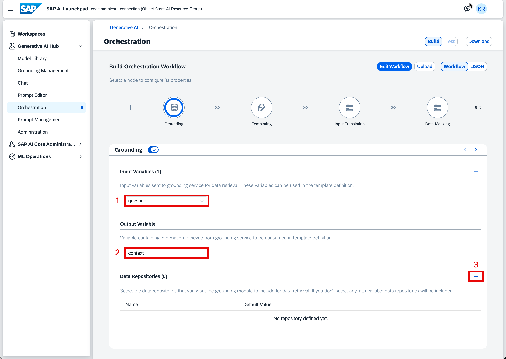

The available data repository is displayed in the pop-up dialog.

👉 Select the data repository.

👉 Click on **Select**.

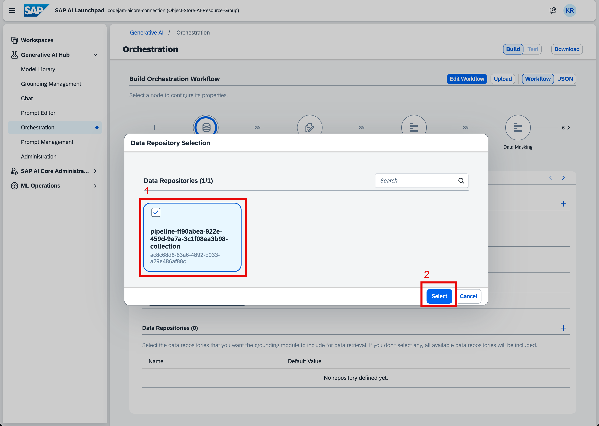

### Templating

You have already created a prompt template in [Exercise 02 - Create a Prompt Template](../02-create-prompt-template/readme.md). This template is handy for the orchestration now as you can reuse the template here.

👉 In your workflow, advance to the next node by selecting **Templating**.

👉 Within the **Templating** section, make sure to click on the **Select** button to select your prompt template.

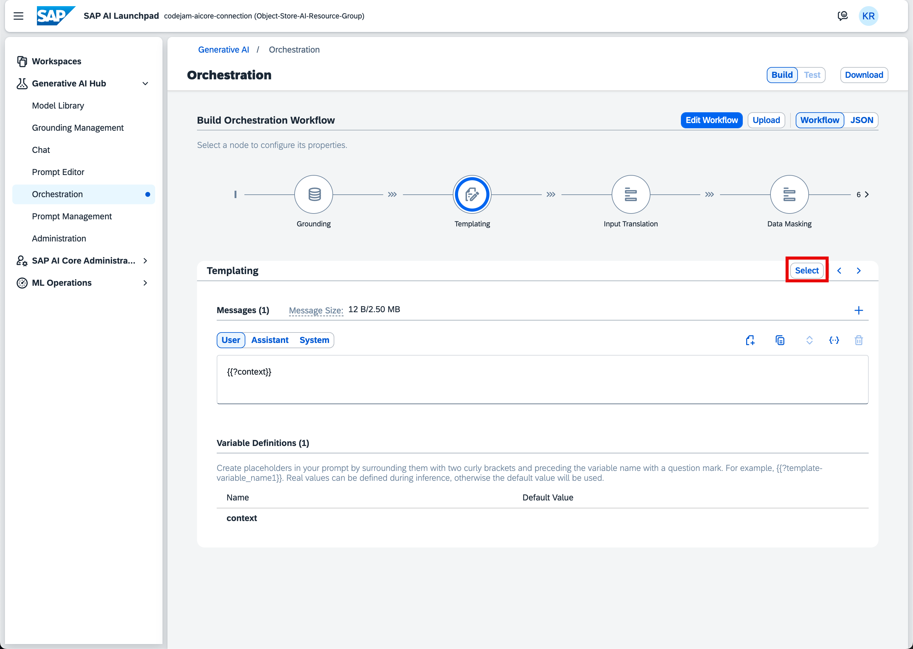

👉 Search and select your prompt template. You can find the template by searching for your initials or whatever name you chose.

👉 Click on **Select** to apply the template to the workflow.

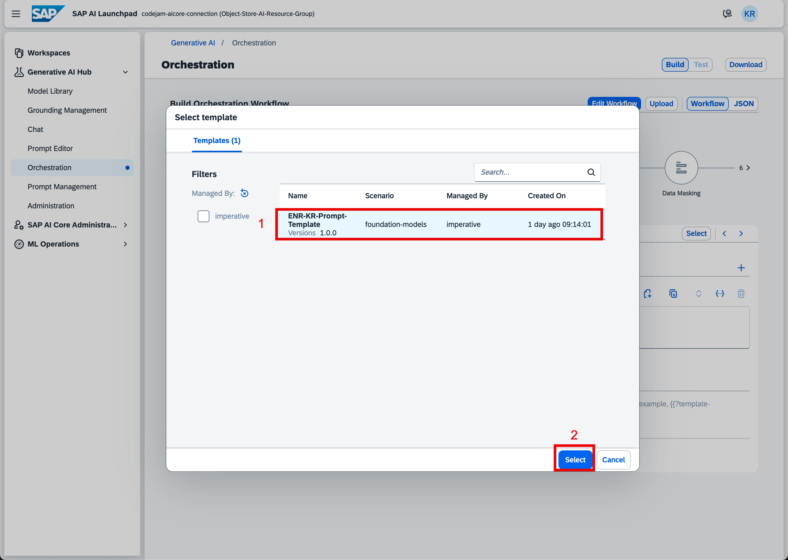

You can see that the template has been applied to your workflow.

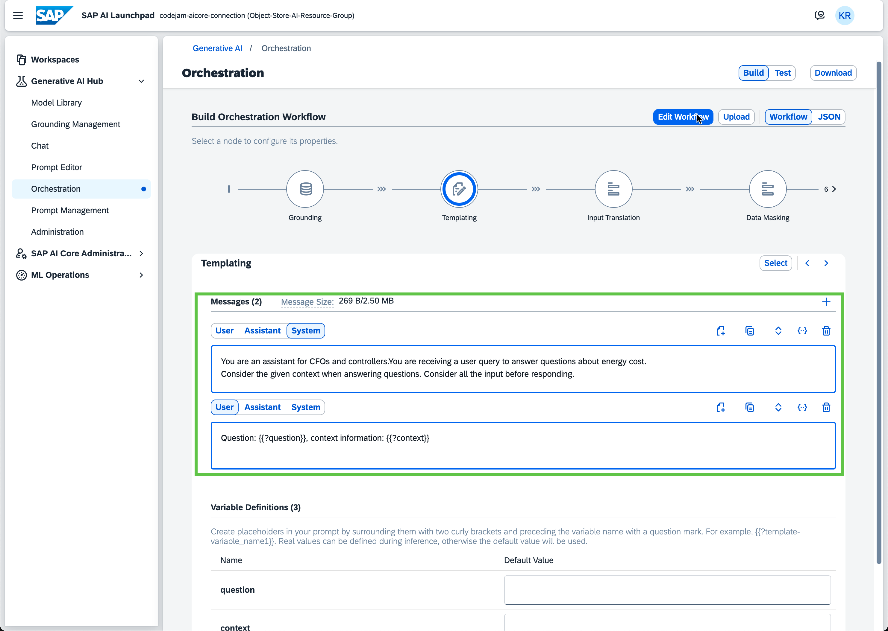

### Input Translation

👉 In your workflow, advance to the next node by selecting **Input Translation**.

Input translation allows you to automatically translate user questions to a defined target language. This can be helpful if you want to support different types of localization but you know that the LLM used can only understand English, for example.

You will not utilize this for your workflow.

👉 Deactivate **Input Translation** by toggling the switch.

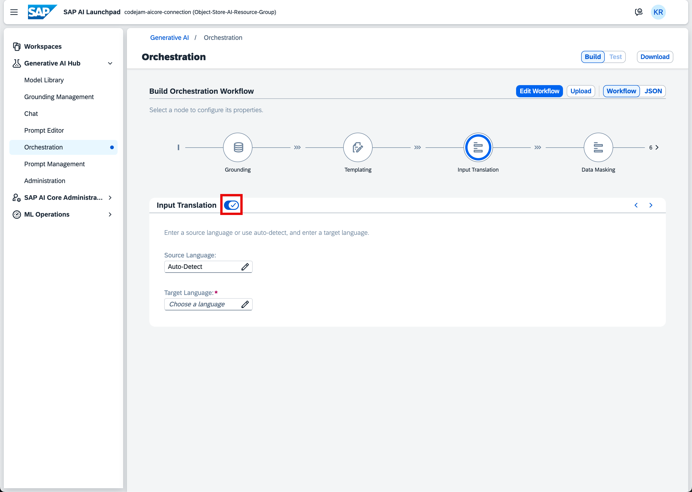

### Data Masking

👉 In your workflow, advance to the next node by selecting **Data Masking**.

Before you do any configuration here, let's talk about Data Masking and what it implies.

Data masking describes the process of making defined sets of data unreadable to a human or machine. This process can be achieved via anonymization or pseudonymization. In the following sections, you will learn what they are and how they differ.

#### Anonymization

Anonymization describes the process of completely removing or altering any sensitive data like names, addresses, financial data, or healthcare data. The result of the anonymization process makes the data irreversible, which results in data privacy compliance for most privacy regulations like GDPR and CCPA. Because the data gets completely removed or altered, it is not linkable to any individual person and so anonymized data is exempt from most privacy regulations.

A downside of this is the point of irreversibility of the data. Sometimes, you want to send contextual information to the LLM, removing all personal and sensitive data to comply with data privacy, but after receiving the result of the LLM, you want to restore the original information to have all data available for your use case. In that case, you might want to consider using pseudonymization.

#### Pseudonymization

Pseudonymization describes the process of replacing identifiable information with artificial identifiers or pseudonyms — hence the name pseudonymization. This allows for the creation of a mapping table where these identifiers or pseudonyms can be mapped to the original information, allowing you to restore the pseudonymized data. Because you are just replacing information with pseudonyms, it is still considered personal data, which requires you to handle data privacy concerns by privacy regulations. That means security measures for data theft, data misuse, and unauthorized re-identification using the mapping table.

The benefits for many generative AI use cases are that you can pseudonymize the data of the contextual information you're sending to the LLM and restore the full data set after you have received the LLM's response. You are also still allowing for regulatory compliance with GDPR or CCPA but must ensure that security measures are in place.

In both cases, pseudonymization or anonymization, it is always good to have legal involved to ensure complete compliance.

---------------

👉 Go ahead and check the following checkboxes to select for which properties you want to apply data masking:

- Email Addresses
- Person Names
- SAP Staff User ID Numbers
- Phone Numbers
- Usernames and Passwords

👉 Check the checkbox for **Apply to Grounding Input**. This allows you to apply the data masking criteria for the grounded contextual document as well.

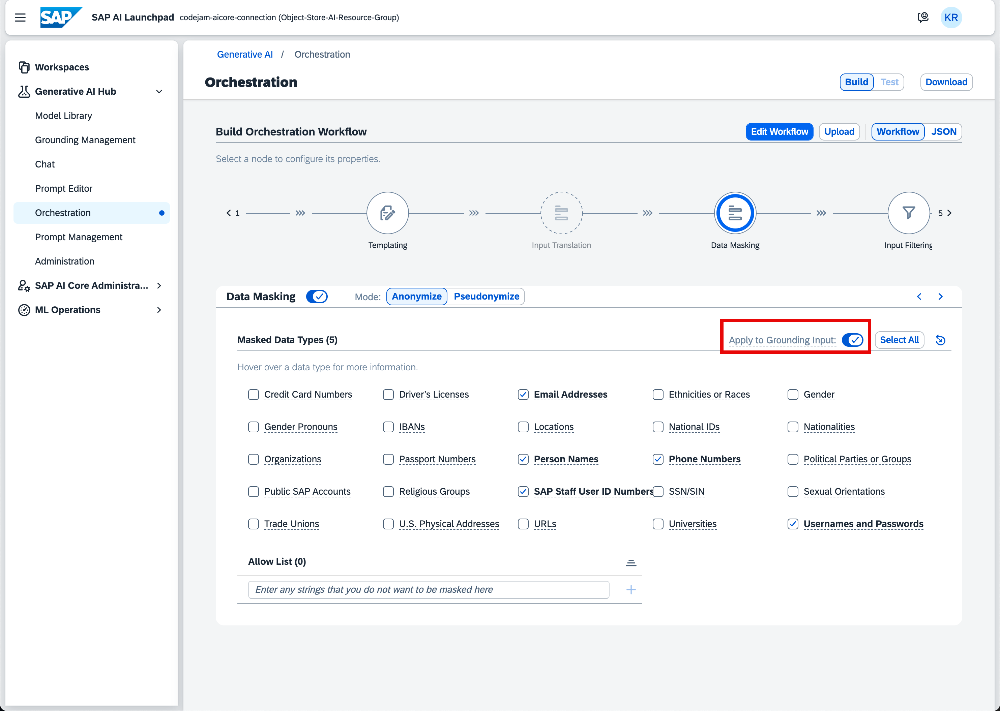

### Input Filtering

👉 In your workflow, advance to the next node by selecting **Input Filtering**.

Input filtering for LLMs refers to the process of screening and modifying the input data before it is sent to the model. Input data is the user's input, be it text or any files. The main goal is to prevent sensitive, inappropriate, or unwanted content from being processed by the LLM. This helps ensure compliance with data privacy regulations, improves the quality of model outputs, and protects against misuse.

Most LLMs already apply a default set of input filters for input data, and SAP is also setting additional filters to avoid inappropriate data input, but there are APIs allowing you to define input filters to your needs.

SAP is providing two third-party APIs: the Azure Content Safety Filters and Llama Guard 3.

The levels for the Azure Content Safety Filters are as follows:

- ALLOW_ALL
- ALLOW_SAFE
- ALLOW_SAFE_LOW
- ALLOW_SAFE_LOW_Medium

This helps you to prevent hateful speech, violent speech, and other inappropriate input but also output from the model. This allows you to granularly define how content should be filtered and to what degree such language should be allowed.

If the user query successfully runs through the content filter, the response will be **200**. In case the content filter catches a user query, you should receive a **400**. When you are testing your service, you can change the filter values to see how it applies to different user query inputs.

👉 Activate the **Azure Content Safety** by checking the checkbox **Select All**.

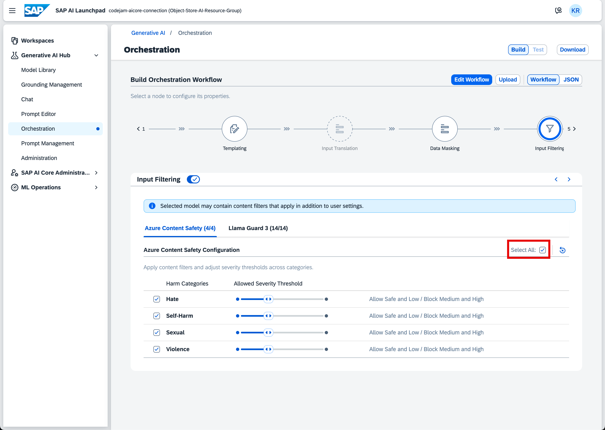

👉 Activate the **Llama Guard 3** filters by checking the checkbox **Select All** in the **Llama Guard 3** tab.

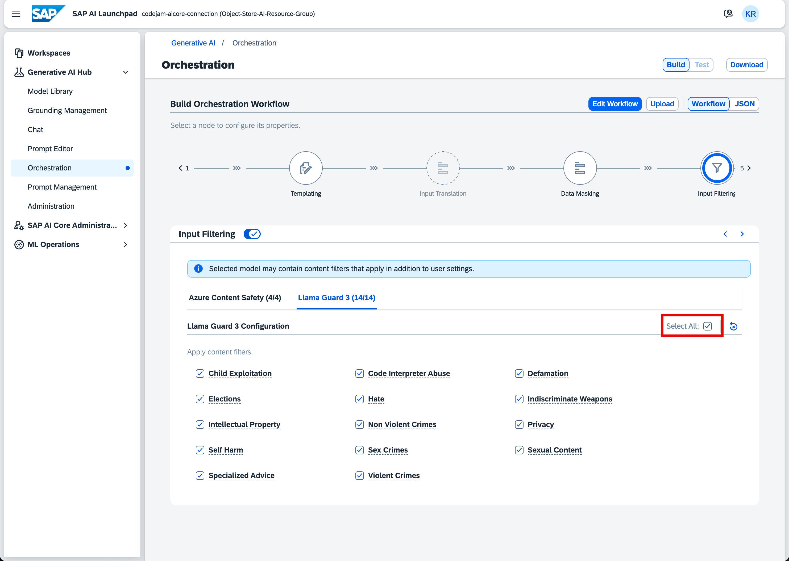

### Model Configuration

👉 In your workflow, advance to the next node by selecting **Model Configuration**.

In this step, you can define which LLM you want to use for the orchestration workflow. This is an important step because the underlying model will define the results of your user's input.

For this workshop, you will utilize the `GPT-4.1 mini` model.

👉 Select the model selection icon to open the **Model Library**.

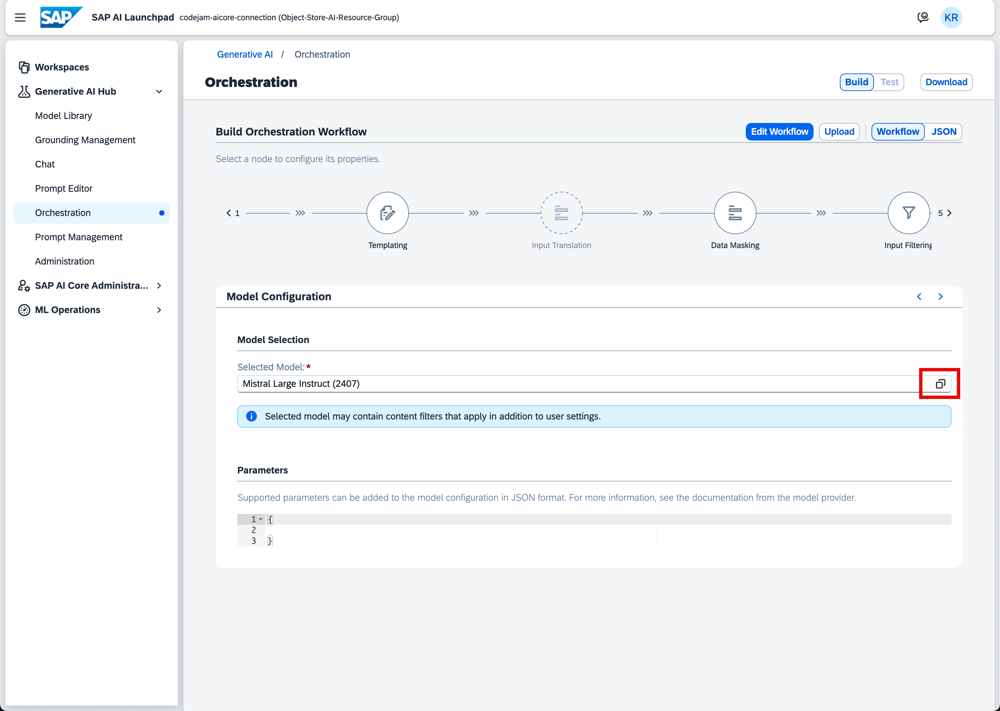

👉 In the **Model Library**, select the `GPT-4.1 mini` model.

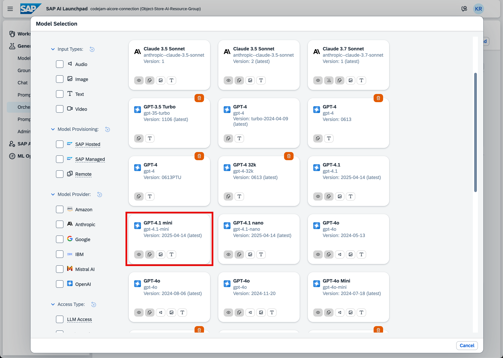

### Output Filtering

👉 In your workflow, advance to the next node by selecting **Output Filtering**.

Output filtering for LLMs is the process of screening and modifying the model’s generated responses before they are returned to the user or downstream systems. The main goal is to prevent the release of sensitive, inappropriate, or unwanted content, ensuring that the output complies with organizational policies, legal regulations, and ethical standards.

**Key aspects of output filtering:**
- **Sensitive Data Protection:** Removes or masks confidential information, personal data, or proprietary business details that may have been generated by the model.
- **Content Moderation:** Detects and blocks offensive, harmful, or policy-violating language, such as hate speech, violence, or explicit content.
- **Compliance:** Ensures that the output adheres to data privacy laws (e.g., GDPR) and company guidelines.
- **Quality Control:** Filters out irrelevant, low-quality, or hallucinated content to improve the reliability and usefulness of the model’s responses.

Output filtering can be implemented using built-in model features, third-party APIs (such as Azure Content Safety or Llama Guard), or custom logic.

In the orchestration workflow, output filtering refers to content moderation.

👉 Activate the **Azure Content Safety** by checking the checkbox **Select All**.

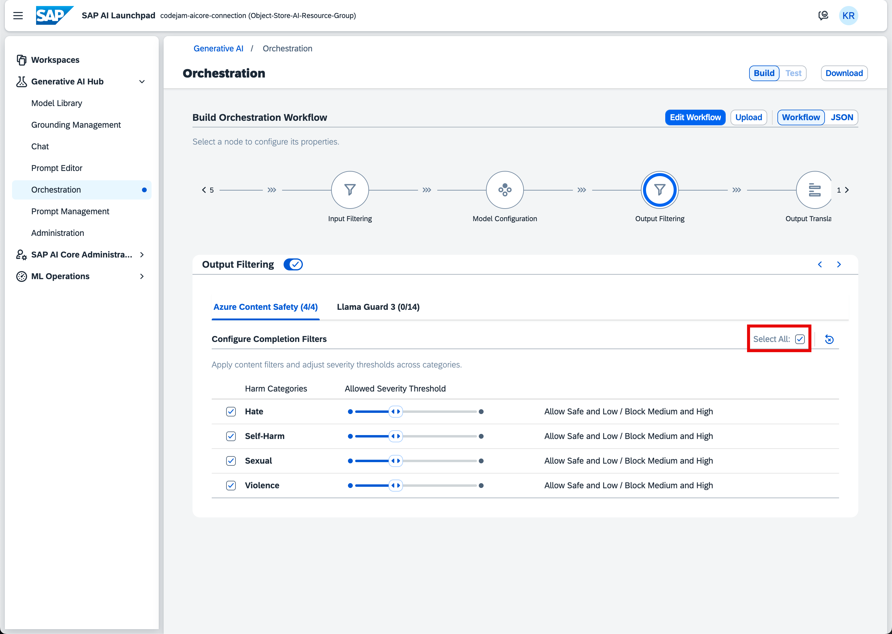

👉 Activate the **Llama Guard 3** filters by checking the checkbox **Select All** in the **Llama Guard 3** tab.

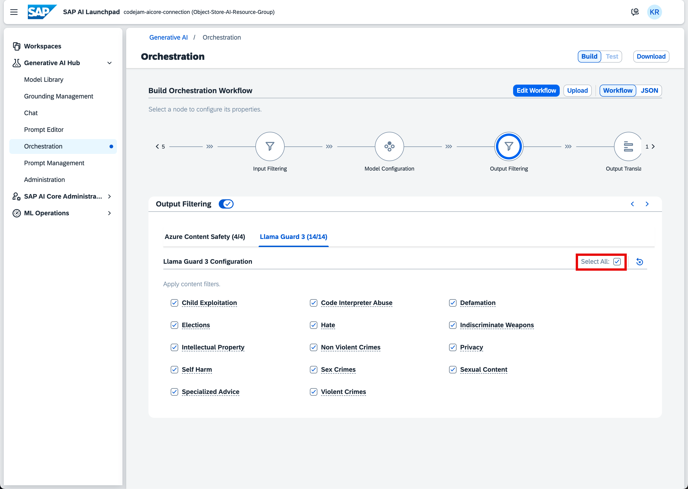

### Output Translation

👉 In your workflow, advance to the next node by selecting **Output Translation**.

The output translation allows you to translate the LLM's response to a target language. You will not utilize this feature for today.

👉 Deactivate it by toggling the switch.

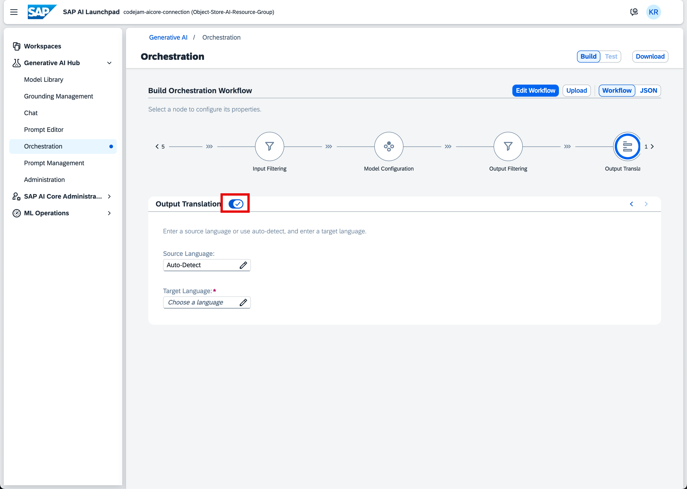

## Test the orchestration configuration

The orchestration configuration is completed; it is time to test it.

👉 Click on the **Test** button in the top-right corner.

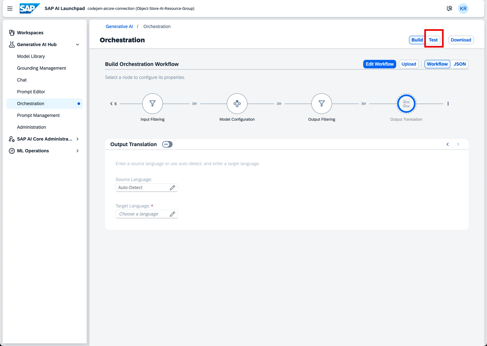

A new screen opens, allowing you to enter input for the **question** variable. Now you can test the configuration pretending to be an end-user.

👉 Enter the following question and inspect the output response:

```text
Give me a comparison between the commercial cost of solar energy to oil within Europe.
```

The expected output should use the grounded contextual document to answer your question, automatically applying the prompt template and all masking and filters.

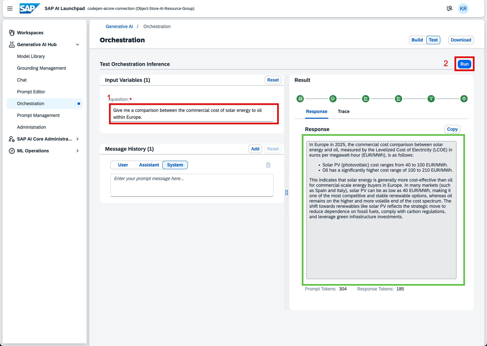

You can also inspect the trace of the orchestration inference. This is really helpful to understand what is happening in the background.

👉 Click on **Trace** right next to the **Response**.

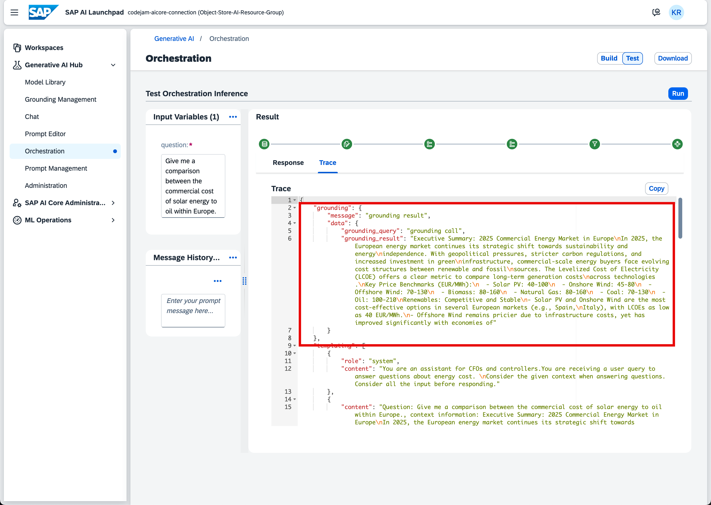

As you can see, the trace shows you the grounding result, which also got displayed in the response.

If you scroll down, you can also see how the template got applied.

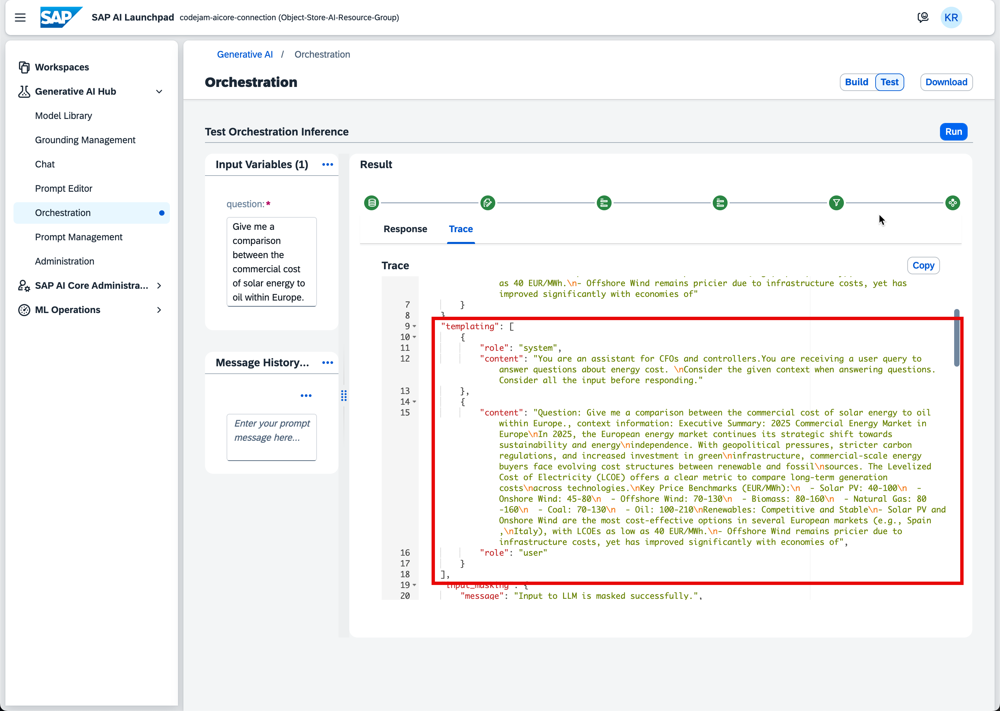

Further down, the input masking was executed. For this query, no masking was required because neither the input nor the output included any sensitive data. In a later exercise, you will test this further.

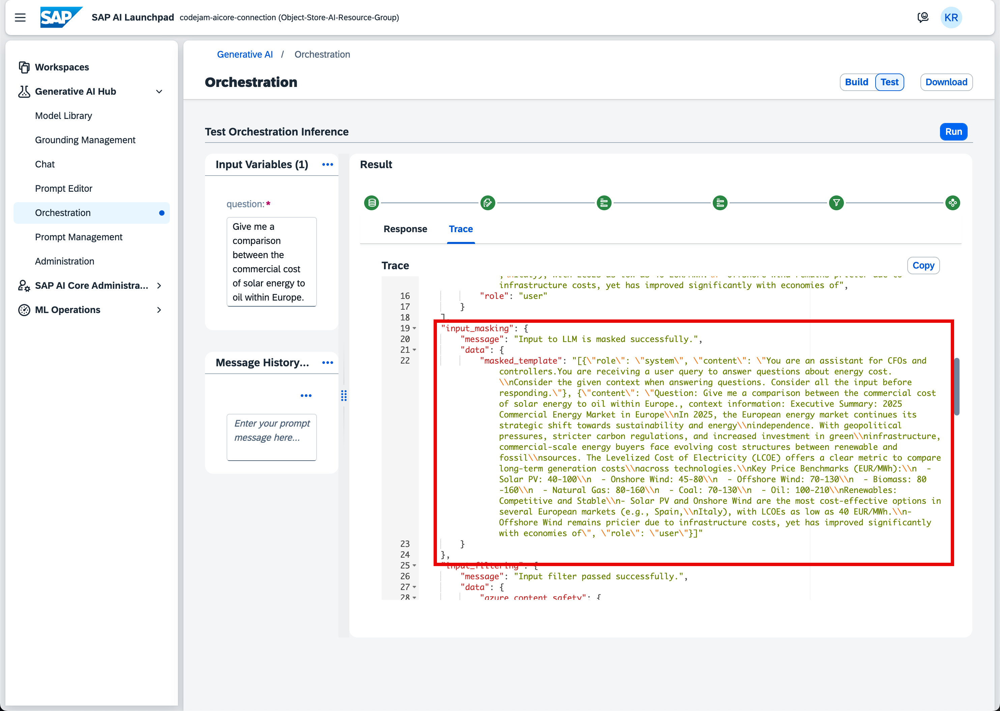

The input filter passed successfully, and no filtering needed to be executed.

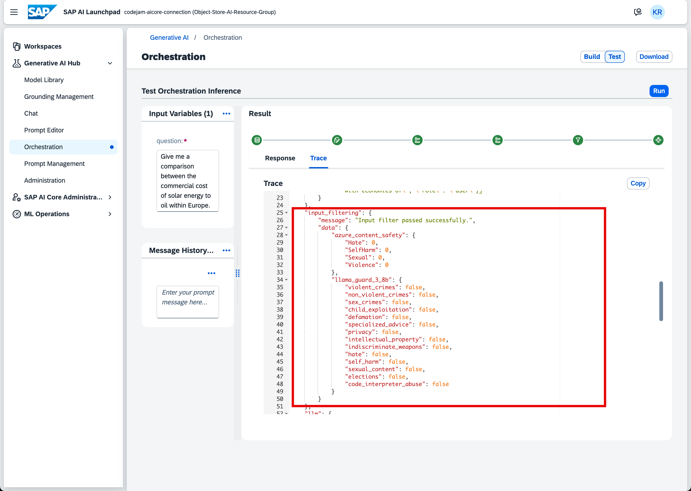

You can further scroll through the trace to inspect all the other configurations and their results.

👉 Finally, inspect the configuration in its JSON format by clicking on **JSON**.

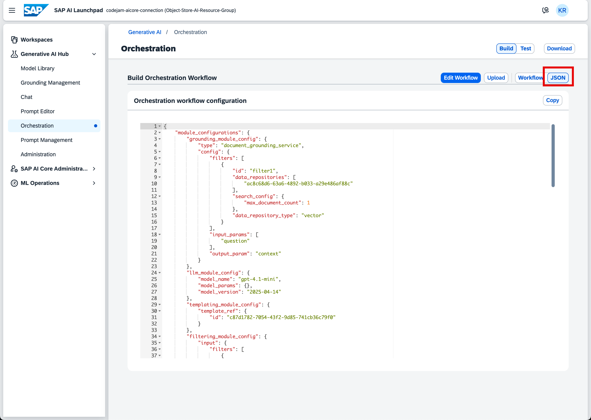

The JSON representation is our machine-readable format to apply the orchestration configuration in a real-world scenario through code or API calls.

## Summary

You have learned how to create an orchestration workflow, configure and test it. You have also learned how to understand what is happening in the background by inspecting the traces. In the end, you displayed the orchestration configuration as JSON.

### Questions for Discussion

1. Can you save the orchestration configuration in SAP AI Launchpad?
<details><summary>Answer</summary>
   No, in SAP AI Launchpad it is not possible to save the configured orchestration, but you can download the machine-readable JSON to use it in code or via APIs. You can, at a later point, upload the JSON document to SAP AI Launchpad in case you need to change any configuration or further test it.
   </details>

## Further reading

- [Orchestration Workflow - Help Portal (Documentation)](https://help.sap.com/docs/sap-ai-core/sap-ai-core-service-guide/orchestration-workflow?locale=en-us)

---

[Next exercise](../04-orchestration-test-anonymization-pseudonymization/readme.md)