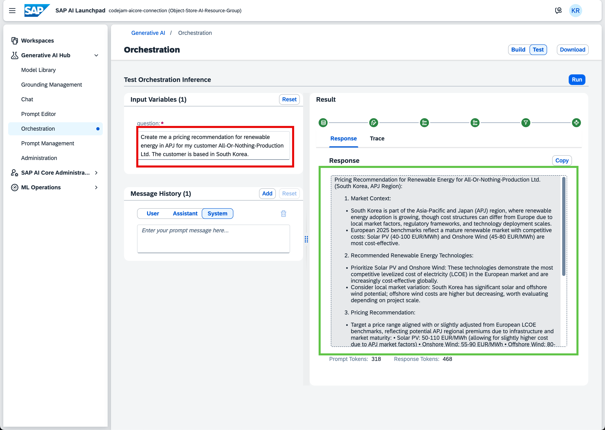
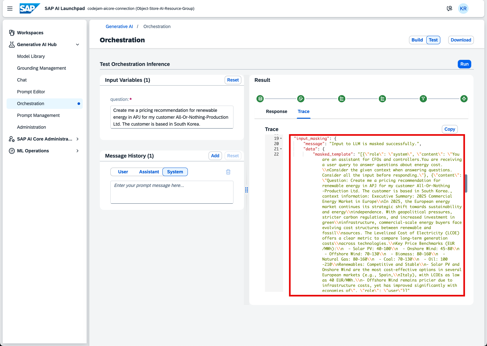
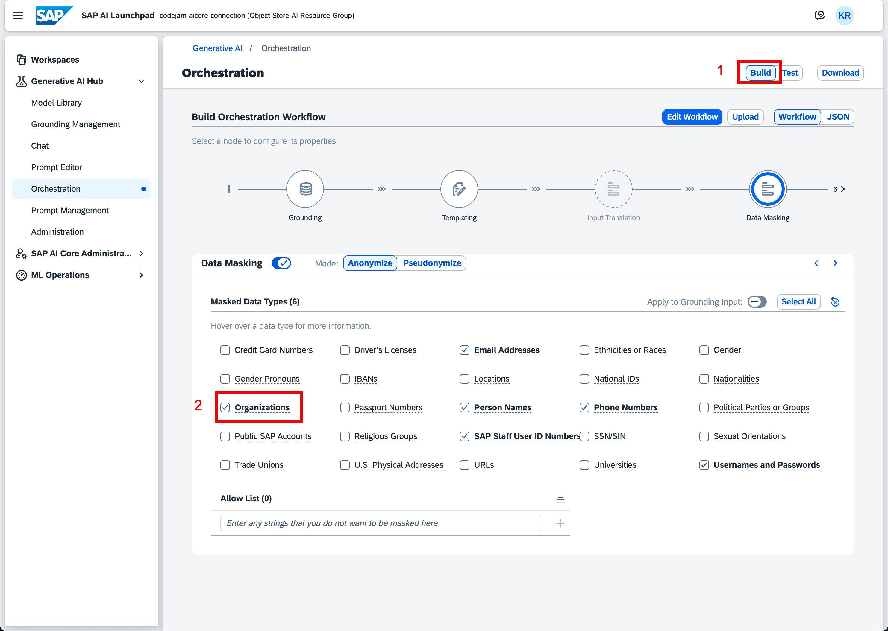
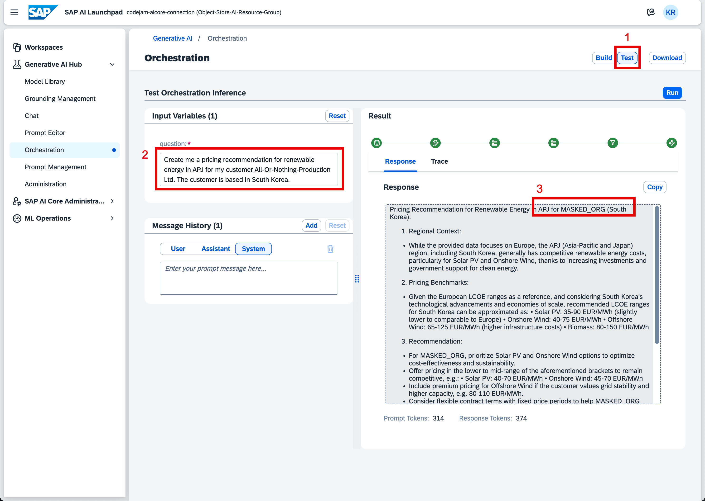
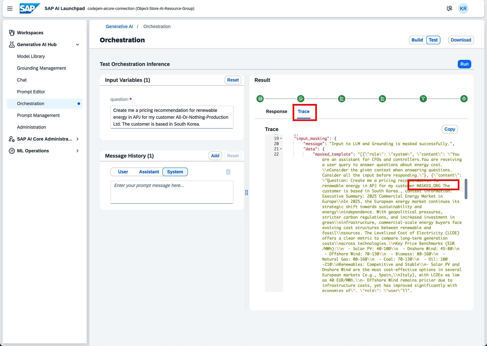
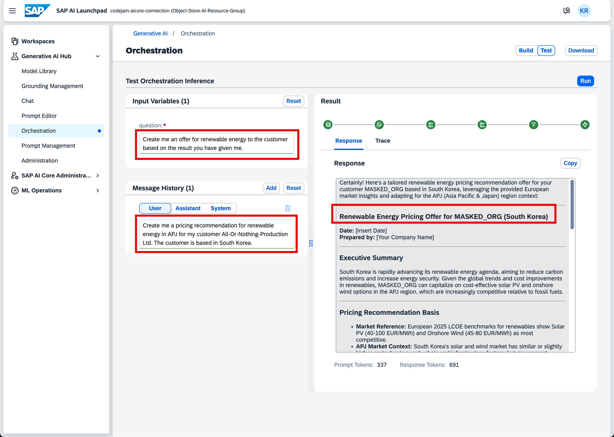
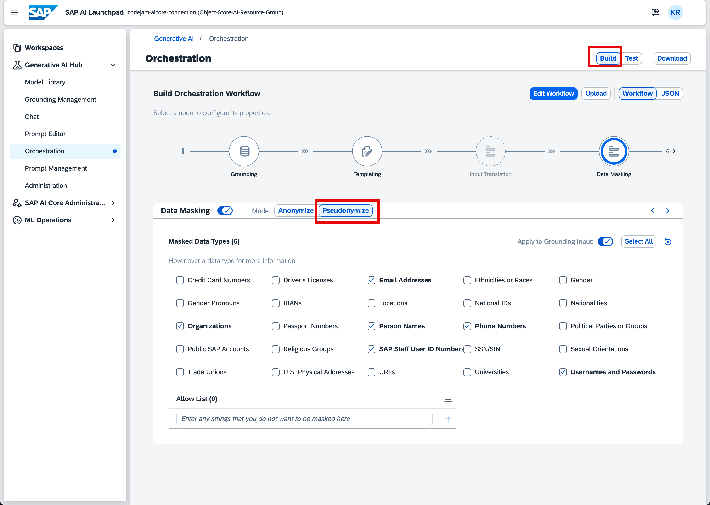
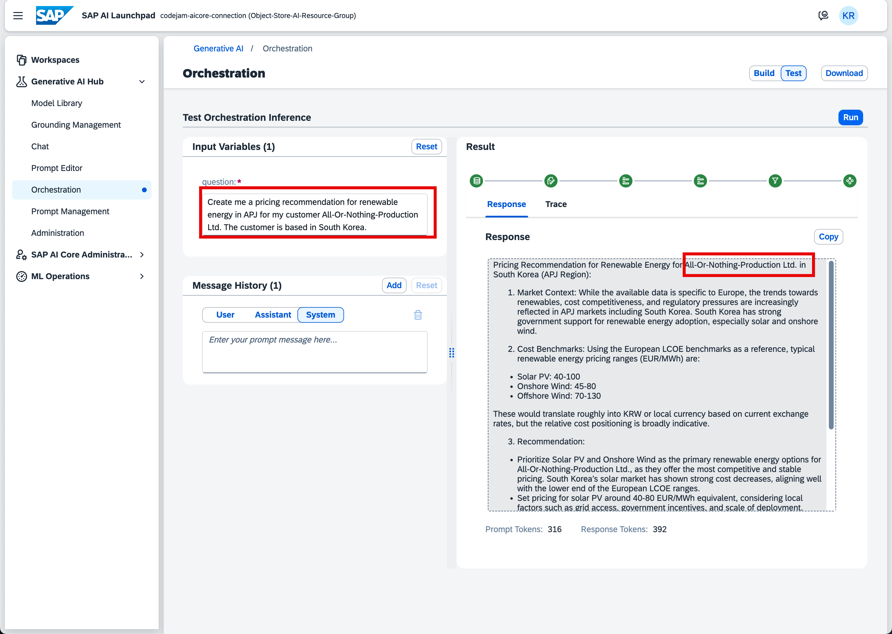
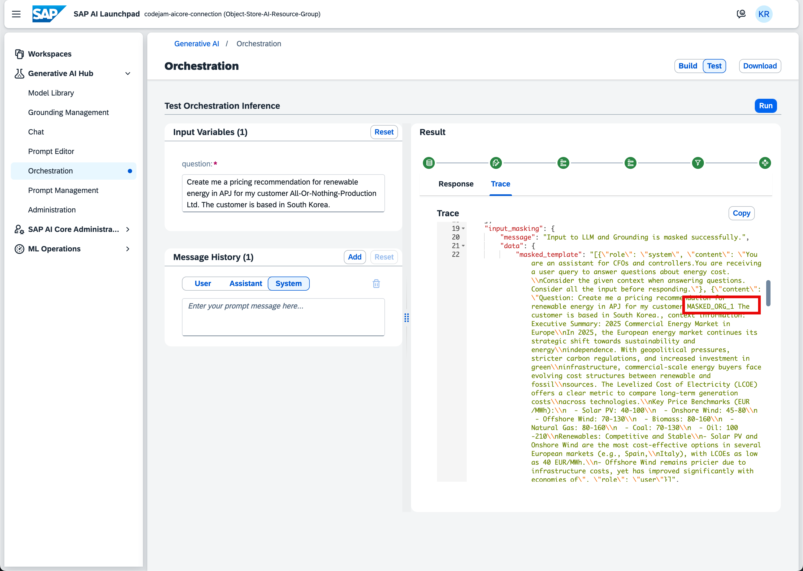
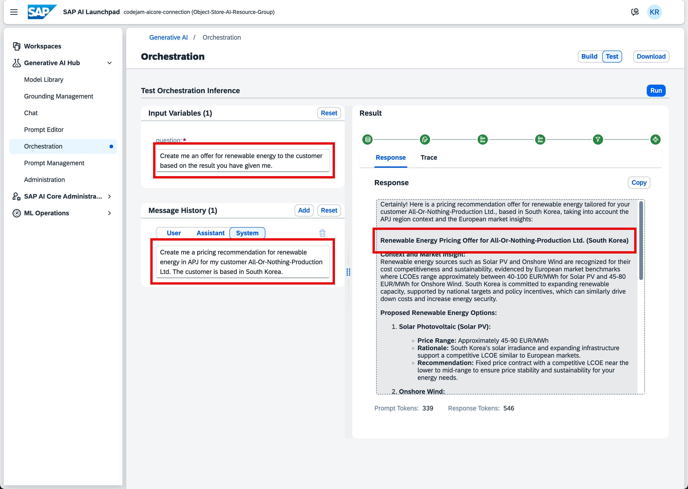

# Exercise 04 - Learn more about Data Masking

_Estimated Time: **25 min**_

In this exercise you will experiment more with the data masking capabilities of the orchestration workflow.
Last exercise, you have set up the data masking configuration but couldn't properly test it. Now, you will try different queries to see the data masking being applied. You will also switch between anonymization and pseudonymization to see the differences.

## Table of Contents

- [Exercise 04 - Learn more about Data Masking](#exercise-04---learn-more-about-data-masking)
- [Change the Data Masking configuration to include Organizations](#change-the-data-masking-configuration-to-include-organizations)
- [Change the Data Masking configuration to use Pseudonymization](#change-the-data-masking-configuration-to-use-pseudonymization)
- [Summary](#summary)
  - [Questions for Discussion](#questions-for-discussion)
- [Further reading](#further-reading)

## Change the Data Masking configuration to include Organizations

Go back to the **Test Orchestration Inference** site to execute another query against your orchestration.

👉 In the input field enter the following text:

```text
Create me a pricing recommendation for renewable energy in APJ for my customer All-Or-Nothing-Production Ltd. The customer is based in South Korea.
```
If you inspect the LLM's response closely, you can tell that the customer's name was not anonymized in the response.



👉 To make sure that the data masking was not applied check the **Trace**.

Within the `input_masking`, you can clearly see that the customer's name was not anonymized. You want to change this.



👉 Click on the **Build** button to navigate back to the orchestration workflow.

👉 Now, select the **Data Masking** node and check the **Organizations** checkbox.



👉 Go back to the **Test Orchestration Inference** screen and input the same query as before.



Great! In the response, you can see that the customer's name was successfully anonymized by interchanging the name with `MASKED_ORG`.

👉 To double-check, open the **Trace** view and check the `input_masking`.



You can see that in the trace the masking was applied!

## Change the Data Masking configuration to use Pseudonymization

Let's play around a bit more. You can utilize the Message History to provide history context for further queries against the LLM. 

👉 Copy and paste the text from the input field to the **Message History** text field as **User** message.

👉 Now, ask the model to create an offer for the customer. Enter the following text to the input field.

```text
Create me an offer for renewable energy to the customer based on the result you have given me.
```



The LLM responded with an offer for the customer but the customer's name is anonymized. When creating an offer, the offer should include the customer's name. The reason why the name is anonymized here is that anonymization is not reversable. To fix this issue, change the data masking technique to pseudonymization.

Pseudonymization masks the input to the LLM but unmasks it in the response. That is exactly what you want.

👉 Change back to the **Build** view and navigate to the **Data Masking** node.

👉 Make sure to switch from **Anonymize** to **Pseudonymize**.

👉 Make sure the checkboxes are still correct.



👉 Go back to the **Test Orchestration Inference** screen.

👉 Ask the question again:

```text
Create me a pricing recommendation for renewable energy in APJ for my customer All-Or-Nothing-Production Ltd. The customer is based in South Korea.
```

As you can see, the result has the customer's name in the response. Double-check the trace to see if the masking was applied when sent to the LLM.



👉 Switch to the **Trace** view.

Great! In the `input_masking`, you can clearly see that the customer's name was masked when sent to the LLM and unmasked in the response text! That is what you wanted.



👉 Now, ask the LLM to create you the offer again:

```text
Create me an offer for renewable energy to the customer based on the result you have given me.
```

Amazing! The offer was created including the customer's name.



If you want to, you can play around with the different masking configurations until we proceed to the next exercise.

## Summary

In this exercise, you have successfully explored the results of anonymization and pseudonymization. You understood the differences and experimented with different queries to achieve the results you wanted.

### Questions for Discussion

1. What masking approach do you need if you want to mask sensitive data for the LLM but have it visible in the LLMs response?
<details><summary>Answer</summary>
   To mask sensitive data for the LLM but unmask it in the response, you would need to use pseudonymization.
   </details>

2. Where can you see the results of data masking in SAP AI Launchpad?
<details><summary>Answer</summary>
You can see the result in the response field but better would be to check the tracing view because that proves what was sent to the LLM.
</details>

## Further reading

- [Data Masking using Orchestration Client - Sample Code](https://github.com/SAP/ai-sdk-js/blob/f0d290f76b4abb813088f50bedf18a8a4e97187f/sample-code/src/orchestration.ts#L231)
- [Data Masking - SAP Cloud SDK for AI](https://github.com/SAP/ai-sdk-js/blob/main/packages/orchestration/README.md#data-masking)
- [Data Masking - SAP AI Launchpad documentation](https://help.sap.com/docs/ai-launchpad/sap-ai-launchpad/data-masking?locale=en-US&q=data+masking)
- [Data Masking - Generative AI Hub documentation](https://help.sap.com/docs/sap-ai-core/sap-ai-core-service-guide/data-masking?locale=en-US&q=data+masking)

---

[Next exercise](../05-orchestration-test-input-output-filtering/readme.md)